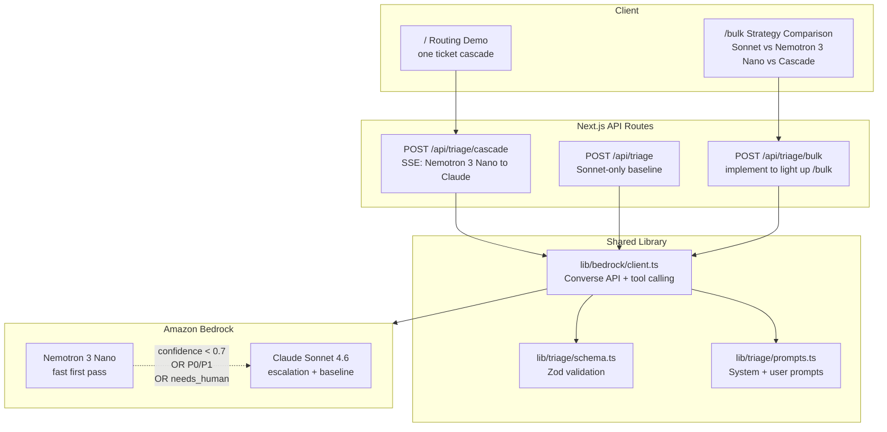

# sample-nvidia-nemotron-cascade-workshop

Sample code for **two-tier LLM inference** — also called **LLM cascading**
or **confidence-based model routing** — on **Amazon Bedrock**. NVIDIA
Nemotron 3 Nano 30B A3B handles the easy, high-volume support-ticket
classification path; harder or higher-stakes tickets escalate to Anthropic
Claude Sonnet on the same Bedrock API surface. After this first mention, the
model is shortened to **Nemotron 3 Nano**.

The app classifies support tickets, but ticket triage is only the example. The
pattern applies to lead scoring, moderation, alert routing, document
classification, and other workloads where most requests are routine and a
small tail needs a stronger model.

Clone, point at your Bedrock account, and try it. Or use it as a workshop
scaffold — the structure supports both.

## What's In The Repo

The repo already includes:

- A single-ticket baseline endpoint: `POST /api/triage`
- A one-ticket cascade demo: `POST /api/triage/cascade`
- A `/bulk` UI that lights up once `POST /api/triage/bulk` is implemented
- Shared Bedrock Converse API client code, Zod schemas, prompts, tests, and
  synthetic ticket data
- A bake-off harness comparing Sonnet-only, Nemotron 3 Nano-only, and cascade
  modes

The bulk endpoint is intentionally left as an exercise. Implement it to see
the same cascade scale — Nemotron 3 Nano first on every ticket, escalating to Claude
Sonnet when escalation rules fire, streaming NDJSON rows back to the `/bulk`
table as each ticket finishes. Spec is in
[docs/phase2-change.md](docs/phase2-change.md).

## Architecture



## How To Use This Repo

| Step | What you do | Result |
|---|---|---|
| 1. Spin up | Install deps, configure AWS credentials, call `/api/triage` | Proves Bedrock access works |
| 2. See the cascade | Use `/` to watch Nemotron 3 Nano resolve or escalate one ticket | Makes the routing pattern concrete |
| 3. Build bulk triage | Implement `POST /api/triage/bulk` using your preferred AI coding assistant | Scales the same pattern to many tickets |
| 4. Compare strategies | Run `/bulk` and `npm run bakeoff -- --dry-run --all` | Cost, latency, and agreement side by side |
| 5. Productionize | Review retries, throttling, guardrails, evals, and rollout strategy | Turns sample code into a deployment pattern |

The repo is intentionally partner-agnostic above the application layer. Use
any coding assistant, IDE, or PR review workflow you want — or run it as a
live workshop with your team. What it teaches is the runtime architecture:
one AWS credential chain, one Bedrock endpoint, multiple models chosen by
workload shape.

## Bake-Off Numbers

Live results from `npm run bakeoff -- --all --limit=30` against 30 synthetic
B2B support tickets:

| Config | Total cost (30 tickets) | Avg latency | Agreement vs separate judge model | Escalation rate |
|---|---:|---:|---:|---:|
| Sonnet 4.6 only | $0.3230 | 4,476ms | 96.7% (29/30) | n/a |
| Nemotron 3 Nano only | $0.0184 | 680ms | 83.3% (25/30) | n/a |
| Partnership cascade (Nano + Claude) | $0.2774 | 4,326ms | 93.3% (28/30) | 80.0% (24/30) |

Claude Opus 4.7 serves as a separate judge model. It labels each ticket once
as a proxy answer key; the strategies are compared against those labels. Opus
is not called by the live app. Costs are computed from actual token usage
returned by the Bedrock Converse API, using the pricing constants in
`lib/bedrock/models.ts`; they are comparative sample costs, not billing quotes.

These figures describe behavior on this 30-ticket workshop sample, not
expected production performance. The high-disagreement category list was
derived from disagreements in this same evaluation set, so teams should tune
on a separate calibration set and report final quality on independent test
data before production use.

### How to read these numbers

This is a deployment-strategy comparison, not a model comparison. Nemotron 3
Nano and Claude Sonnet are doing different jobs in the cascade — Nano handles
the high-volume routing pass on every ticket; Claude handles the long tail
that the routing logic flags as needing a stronger model. The numbers above
show three legitimate deployment shapes you might choose:

- **Nano alone** is ~18× cheaper and ~7× faster than Sonnet alone, at 83%
  agreement with the Opus answer key. Strong fit when latency or cost matters
  more than the last 10 points of category accuracy, or when downstream
  consumers can tolerate occasional re-classification.
- **Partnership cascade** reaches 93.3% agreement at about 14% lower cost than
  Sonnet-only in this run, while Sonnet-only reaches 96.7%. Nano handles every
  ticket; Claude is invoked only when Nano's output trips a domain-tuned
  escalation rule. The result is a measured cost-quality tradeoff, not an
  equal-quality claim. Teams should tune and validate that tradeoff on their
  own calibration and test data.
- **Sonnet alone** is the simplest deployment when you don't yet have data
  to tune escalation against and budget isn't tight.

The cascade's win-rate depends entirely on the escalation logic. Confidence
and stakes signals alone do not catch every Nano mistake — Nano can be
confidently wrong on adjacent categories (e.g., `integration` vs
`feature_request`). The example escalation in `scripts/bakeoff.ts` adds a
hardcoded high-disagreement category list as a workshop starting point.
Production teams replace this with a learned router trained on their own
historical Nano-vs-Claude disagreements; see *Production Caveats* below.

These numbers should be refreshed before publication with:

```bash
npm run bakeoff -- --label --limit=30
npm run bakeoff -- --all --limit=30
```

## Quickstart

```bash
npm ci
cp .env.example .env.local
npm run dev
```

Open <http://localhost:3000>.

Smoke test the baseline endpoint:

```bash
curl -X POST http://localhost:3000/api/triage \
  -H 'Content-Type: application/json' \
  -d "$(jq '.[0]' data/sample-tickets.json)"
```

The app uses the AWS SDK default credential chain. Whatever makes this command
work will also make the app work:

```bash
aws sts get-caller-identity
```

## Credentials

Set the region in `.env.local`:

```bash
AWS_REGION=us-west-2
AWS_PROFILE=default
```

If you are using temporary STS credentials, use:

```bash
AWS_REGION=us-west-2
AWS_ACCESS_KEY_ID=<temporary-access-key-id>
AWS_SECRET_ACCESS_KEY=<temporary-secret-access-key>
AWS_SESSION_TOKEN=<temporary-session-token>
```

Do not commit `.env.local` or any real credentials.

## Build The Bulk Endpoint

Add `POST /api/triage/bulk`.

Request:

```json
{ "tickets": [{ "id": "T-001", "subject": "...", "body": "...", "customer_tier": "pro" }] }
```

Response: `application/x-ndjson`, one JSON object per line.

Required behavior:

- Validate every input ticket with `TicketSchema`.
- Call Nemotron 3 Nano first for every ticket.
- Escalate to Claude Sonnet when Nano's output trips an escalation rule.
  Match the logic in `scripts/bakeoff.ts:shouldEscalate` — confidence,
  stakes (P0/P1, needs_human, abuse), and a domain-tuned high-disagreement
  category list. Production deployments replace the category list with a
  learned router; see *Production Caveats*.
- Bound concurrency to avoid unbounded Bedrock calls.
- Retry throttling and transient 5xx failures with exponential backoff and
  jitter.
- Attach optional Bedrock Guardrails when `BEDROCK_GUARDRAIL_ID` and
  `BEDROCK_GUARDRAIL_VERSION` are configured.
- Validate every model output with Zod before streaming it.
- Add tests that mirror `tests/triage.test.ts`.

The full implementation spec is in
[docs/phase2-change.md](docs/phase2-change.md).

## Scripts

| Command | What it does |
|---|---|
| `npm run dev` | Start the Next.js dev server |
| `npm run typecheck` | Run TypeScript checking |
| `npm test` | Run Vitest |
| `npm run generate-tickets` | Regenerate `data/synthetic-1k.json` |
| `npm run bakeoff -- --label` | Generate judge labels |
| `npm run bakeoff -- --all` | Run strategy comparison |
| `npm run bakeoff -- --dry-run --all` | Replay cached comparison results |

## Region And Models

The sample defaults to `AWS_REGION=us-west-2`, but you can use any Bedrock
Region where your account has access to the required models or inference
profiles. Model IDs live in
[lib/bedrock/models.ts](lib/bedrock/models.ts) and should be referenced through
the `MODELS` constant.

Current pins:

```ts
CLAUDE_SONNET:  "us.anthropic.claude-sonnet-4-6"
NEMOTRON_NANO:  "nvidia.nemotron-nano-3-30b"
NEMOTRON_SUPER: "nvidia.nemotron-super-3-120b"
OPUS_JUDGE:     "us.anthropic.claude-opus-4-7"
```

`NEMOTRON_SUPER` remains available for experimentation, but the default
cascade is Nano to Claude Sonnet.

### Future: a third cascade tier

NVIDIA released **Nemotron 3 Ultra** (550B / 55B-active MoE) in June 2026
as a frontier reasoning tier above Super, designed for long-running agentic
workloads including sustained multi-turn planning and sub-agent delegation.
The cascade pattern in this repo extends naturally to a third rung for the
small subset of requests that need deep reasoning. If or when an Ultra-class
model is available through the same managed inference surface, this sample is
structured to extend with a model constant plus an escalation branch, after
validating availability, cost, latency, and quality.

Reference:
[NVIDIA developer blog](https://developer.nvidia.com/blog/nvidia-nemotron-3-ultra-powers-faster-more-efficient-reasoning-for-long-running-agents/).

## Production Caveats

This is sample code, not a turnkey production routing policy. Before shipping
the pattern, run a domain-specific eval, shadow the cascade beside your
existing model, define escalation thresholds with real error costs, set cost
and latency budgets, and monitor retry rate, escalation rate, category drift,
and human override rate.

## Repository Status

This repository is intended for publication as an `aws-samples` sample after
OpenSourcerer self-certification and Public Content Security Review.

Suggested public repo name:

```text
sample-nvidia-nemotron-cascade-workshop
```

## Security

See [SECURITY.md](SECURITY.md) for reporting security issues.

## Contributing

See [CONTRIBUTING.md](CONTRIBUTING.md).

## License

This sample is licensed under the MIT-0 License. See [LICENSE](LICENSE).
