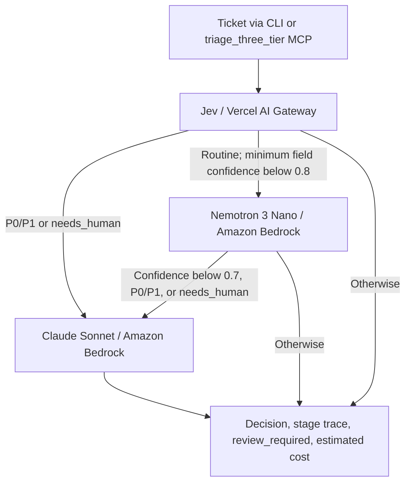
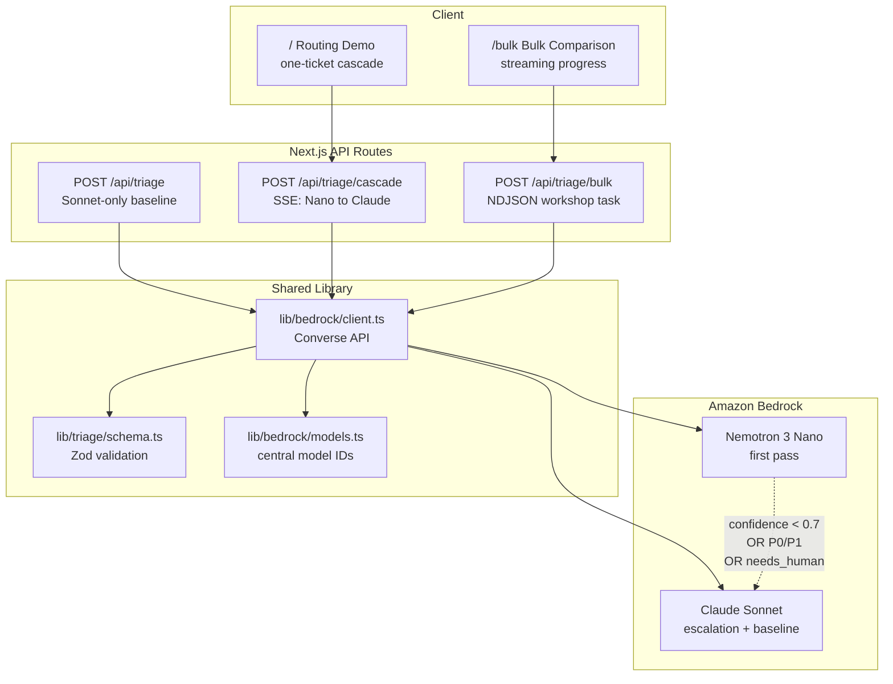

# TicketTriage: model cascade examples

This project started with a classification cascade using **NVIDIA Nemotron 3
Nano 30B A3B** and **Anthropic Claude Sonnet** on Amazon Bedrock. Nemotron 3 Nano
handled the first pass, with selected tickets sent to Sonnet. The work focused
on making those handoffs visible and evaluating quality, latency, and cost together.

The **[three-tier extension](docs/three-tier-example.md)** adds **Jev** through
Vercel AI Gateway ahead of that cascade. Jev classifies first; Nano handles some
uncertain requests; Sonnet handles requests selected by confidence and risk rules.
The question is where each model is useful, and how to measure the resulting
tradeoff on a defined workload.

```bash
git clone --branch push-mcp --single-branch https://github.com/aws-samples/sample-nvidia-nemotron-cascade-workshop.git
cd sample-nvidia-nemotron-cascade-workshop
npm ci
# Recompute the published comparison: no credentials or model calls.
npm run audit:three-tier
```

Run the new example from source or mount its MCP tool. See the guide for live
credentials and commands, and [measured results](docs/three-tier-results.md)
for the evidence and its limits. The existing two-tier web app and workshop
exercise remain available below.

Support-ticket triage is the example, not a product dependency. The pattern
also applies to lead scoring, moderation, alert routing, document
classification, and other workloads where most requests are routine and a
smaller tail needs a stronger model.

The original app was designed for an **instructor-led workshop**. It is
independently runnable and reproducible: the paths, command order,
expected outputs, and manual implementation route are documented below. A
fully self-paced course—with extensive checkpoints, screenshots, recovery
flows, and participant provisioning—is intentionally deferred to possible
Workshop Studio packaging.

## What's In The Repo

- `lib/cascade/three-tier.ts`: Jev → Nano → Sonnet ticket policy and stage trace
- `mcp/server.ts`: `triage_three_tier` and the existing `cascade_classify` tools
- `scripts/compare-three-tier.ts`: paired replay of six model/routing configurations
- `scripts/audit-three-tier.ts`: independent offline recomputation from public records
- `POST /api/triage`: a single-ticket Claude Sonnet baseline
- `POST /api/triage/cascade`: a one-ticket Nemotron 3 Nano to Claude cascade
  streamed as server-sent events (SSE)
- `/bulk`: a bulk comparison UI that becomes active after the workshop task
- `lib/bedrock/client.ts`: the shared Amazon Bedrock Converse API client
- `lib/bedrock/models.ts`: the centralized model IDs and sample pricing
- `lib/triage/schema.ts`: the input and model-output Zod schemas
- `data/sample-tickets.json`: 20 hand-written synthetic tickets for safe smoke
  tests
- `data/production-shaped-1k.json`: coherent production-shaped model inputs
- `data/production-shaped-1k.source-intent.json`: separate synthetic intent
  labels, split metadata, and review status; these are references, not ground
  truth
- `data/production-shaped-1k.metadata.json`: cohort and family assignments
- `data/synthetic-1k.json`: a legacy methodology fixture retained for
  regression compatibility, not publication evidence
- `scripts/bakeoff.ts`: the strategy comparison harness

The optional, original workshop task is to create the exact file
`app/api/triage/bulk/route.ts`, implementing `POST /api/triage/bulk` as a
streaming NDJSON endpoint. The detailed contract and a no-agent manual path
are in [docs/phase2-change.md](docs/phase2-change.md).

## Architecture

### Adding Jev to the existing cascade



Jev returns typed choices for category, priority and human review. Nano and
Sonnet use the existing Bedrock client and ticket schema. Each receives the
ticket and rubric independently; earlier model answers are not passed forward.
Jev is an additional provider integration, so the three-tier path does not use
one Bedrock API for all three models.

Confident routine tickets can stop early. Jev's P0/P1 or human-review signals
bypass Nano. Customer tier remains context, never an escalation rule by itself.
Neither model's confidence is a calibrated correctness probability.
The final model supplies `decision`; `review_required` separately retains
earlier review signals. See the [exact policy](docs/three-tier-example.md).

### Existing two-tier web app

The Next.js demo and original bulk exercise still use Nano → Sonnet. The new
three-tier path is exposed through the source CLI and MCP tool.



## Instructor-Led Run Of Show (Original Two-Tier Exercise)

| Stage | Attendee action | Expected result | Sample time |
|---|---|---|---:|
| 1. Prepare | Install dependencies; verify AWS identity, model access, and one-ticket inference | Both configured models are callable before paid batch work begins | 5–10 min |
| 2. Observe | Run `/` and call the baseline endpoint | One-ticket baseline and cascade behavior are visible | 10 min |
| 3. Implement | Create `app/api/triage/bulk/route.ts` manually or with an optional coding agent | Bulk requests stream valid NDJSON | 30–45 min |
| 4. Verify | Run focused tests, `curl -N`, and `/bulk` | Rows appear while work is still in progress | 10–15 min |
| 5. Compare | Run the paid 30-ticket live bake-off, then replay its cache | Cost, latency, agreement, and escalation are compared | 10–30 min |

These are sample planning estimates, not guarantees. The live bake-off depends
on model availability, account quotas, throttling, and network conditions. The
30-ticket headline run makes 30 Nano calls and 30 Sonnet calls, then composes
the cascade offline without a third set of calls. The first live run is paid;
`--dry-run` is free only after a matching cache exists. Review the recorded
input/output pricing snapshot in `lib/bedrock/models.ts`, confirm current
Amazon Bedrock pricing, and set your own spend limit first. An optional Opus
labeling run adds 30 separately billed calls.

## Quickstart

### Three-tier example and public result audit

With Node.js 22.13+ on the 22.x line, or Node.js 24+, and npm
(`.nvmrc` selects Node.js 24):

```bash
npm ci
npm run audit:three-tier
```

This verifies 150 public result records against the reviewed synthetic labels,
recomputes all six strategies, and checks routing, usage-based cost and aggregate
metrics. It does not need `.bakeoff-cache`, AWS credentials or a Gateway key.
It checks the recorded evidence; it does not rerun models.

For a live classification, supply `AI_GATEWAY_API_KEY` and AWS credentials through
your shell or MCP client's secret settings, then run:

```bash
export AWS_REGION=us-west-2
npm run triage:three-tier -- --example
```

Live calls are paid. The standalone CLI does not automatically load `.env.local`.
See [MCP setup and input/output examples](docs/three-tier-example.md).

### Existing two-tier web app

Prerequisites: the same Node.js version requirement above, npm, AWS CLI
credentials, `curl`, and `jq`.

```bash
npm ci
cp .env.example .env.local
aws sts get-caller-identity
aws bedrock list-foundation-models --region us-west-2 \
  --query "modelSummaries[?contains(modelId, 'nemotron')].modelId"
aws bedrock list-inference-profiles --region us-west-2 \
  --query "inferenceProfileSummaries[?contains(inferenceProfileId, 'claude-sonnet')].inferenceProfileId"
npm run dev
```

Open <http://localhost:3000>. In a second terminal, smoke-test the baseline:

```bash
curl -sS -X POST http://localhost:3000/api/triage \
  -H 'Content-Type: application/json' \
  -d "$(jq '.[0]' data/sample-tickets.json)" | jq
```

Expected output is one JSON routing decision containing a ticket ID, category,
priority, confidence, reasoning, and `needs_human`. Exact classifications,
latency, and cost vary between model invocations. Complete any required
Bedrock or AWS Marketplace model-access step before delivery; listing a model
does not guarantee invoke permission, so this one-ticket call is the final
preflight gate.

The app uses the AWS SDK default credential chain. Whatever makes
`aws sts get-caller-identity` succeed should also make the app authenticate.
The sample Region is `us-west-2`; use a Region where the configured models or
inference profiles are available.

## Workshop Task: Bulk NDJSON (Original Two-Tier Exercise)

Create `app/api/triage/bulk/route.ts`—not `app/api/triage/bulk.ts` and not an
alternate route name. The endpoint accepts:

```json
{
  "tickets": [
    {
      "id": "T-001",
      "subject": "Charged twice",
      "body": "Our card shows the same invoice twice.",
      "customer_tier": "pro"
    }
  ]
}
```

It returns `Content-Type: application/x-ndjson`. NDJSON is a sequence of
complete JSON objects separated by newline characters; it is not one JSON
array and it does not use SSE `event:` or `data:` prefixes. Each ticket emits
its Nemotron 3 Nano result as soon as that call completes. An escalated ticket
then emits a second line containing the Claude result.

```json
{"ticket_id":"T-001","model":"nano","decision":{"ticket_id":"T-001","category":"billing","priority":"P2","confidence":0.92,"reasoning":"Duplicate charge report.","needs_human":false},"escalated":false,"latencyMs":580,"cost":0.0003}
{"ticket_id":"T-002","model":"nano","decision":{"ticket_id":"T-002","category":"auth","priority":"P1","confidence":0.88,"reasoning":"Many users cannot sign in.","needs_human":true},"escalated":true,"latencyMs":610,"cost":0.0003}
{"ticket_id":"T-002","model":"claude","decision":{"ticket_id":"T-002","category":"auth","priority":"P1","confidence":0.98,"reasoning":"Enterprise-wide SSO outage.","needs_human":true},"latencyMs":4180,"cost":0.0033}
```

These values illustrate the NDJSON shape. Actual decisions, latency, token
usage, and estimated cost vary by invocation and pricing snapshot.

With bounded parallelism, different tickets can finish out of input order.
For any one escalated ticket, its `nano` line must precede its `claude` line.
The client decodes response chunks, keeps any incomplete trailing fragment,
splits complete lines on `\n`, and parses each line independently.

Core escalation conditions are exactly:

- Nemotron 3 Nano returns `confidence < 0.7`
- Nemotron 3 Nano returns priority `P0` or `P1`
- Nemotron 3 Nano returns `needs_human: true`

`customer_tier` is optional context for classification. **Customer tier alone
is not an escalation rule.** Do not add `enterprise => escalate` or similar
route logic unless a separately evaluated production policy requires it.

After implementation, safely exercise ten repository-owned synthetic tickets:

```bash
curl -N -sS -X POST http://localhost:3000/api/triage/bulk \
  -H 'Content-Type: application/json' \
  -d "{\"tickets\":$(jq -c '.[0:10]' data/sample-tickets.json)}"
```

Expected behavior: complete JSON lines appear incrementally before the request
finishes; there is at least one `nano` line per ticket and a second `claude`
line only for escalated tickets. In `/bulk`, confirm that each escalated row
also displays whether confidence, P0/P1 priority, or `needs_human` triggered
the route. See [docs/phase2-change.md](docs/phase2-change.md) for the
implementation checklist and optional vendor-neutral coding-agent prompt.

## Bake-Off: Live First, Then Dry-Run

The headline workshop compares three deployment configurations:

1. Claude Sonnet only
2. Nemotron 3 Nano only
3. Nemotron 3 Nano to Claude Sonnet cascade (`routed`)

Nemotron Super is available only as an **experimental fourth benchmark**. It
is not a tier in the headline cascade and should not be mixed into the primary
three-row story. Add `--experimental-super` only when you intentionally want
that extra comparison.

Use only repository-owned synthetic data. The harness supports two profiles:

- `--dataset=production` (default) reads `data/production-shaped-1k.json`, a
  repetitive 85/10/5 routine/ambiguous/high-risk workload.
- `--dataset=stress` reads the legacy `data/synthetic-1k.json` methodology
  fixture. It is not coherent publication evidence and must not be used for
  benchmark claims.

Both profiles default to 30 tickets. Running all 1,000 requires the explicit
`--full-dataset` flag; `--full-dataset` and `--limit` cannot be combined.

The evaluation scope is explicit:

- `--split=workshop` (default): safe 30-ticket instructor-led demonstration
- `--split=calibration`: fixed 50-ticket set for policy tuning only
- `--split=test`: locked 150-ticket set for final evaluation after human label
  review
- `--split=all`: full profile selection; combine with a limit or the explicit
  `--full-dataset` flag

For the workshop, run Nano and Sonnet once each; the script composes the
cascade offline from those exact outputs so strategy comparisons do not add
model-sampling variance:

```bash
npm run bakeoff -- --dataset=production --split=workshop --limit=30 --all
```

Those commands create `.bakeoff-cache/`. Only after the live run succeeds,
verify that the same results can be replayed without new Bedrock calls:

```bash
npm run bakeoff -- --dataset=production --split=workshop --limit=30 --dry-run --all
```

Source-intent metrics are available without a judge call and are labeled as
synthetic references, not ground truth. Opus is an optional reference or
adjudication signal:

```bash
npm run bakeoff -- --dataset=production --split=workshop --limit=30 --label
```

Do not publish calibration or locked-test conclusions until humans review the
corresponding source-intent labels. Review the blind worksheet in
`data/production-shaped-1k.test-review-worksheet.json` and record final labels
in the non-generated
`data/production-shaped-1k.human-review-overrides.json`. Generation never
overwrites reviewer-owned overrides. Locked-test live runs and every
`--claim-summary` invocation fail until all selected labels are marked
`human_reviewed` or `adjudicated`. Near-duplicate scenario families never cross
the calibration/test boundary. Because templates repeat within a scenario
family, quality intervals use a deterministic scenario-family cluster
bootstrap rather than treating every generated ticket as an independent
observation. Every cache records the dataset and label
hashes, model IDs, prompts, routing policy, pricing snapshot, Region,
timestamp, run ID, and available code revision; incompatible caches are
rejected rather than silently reused.

### Review the locked test in the local UI

Do not edit 150 JSON records by hand. Start the local development server and
open the blind review page:

```bash
npm run dev
# open http://localhost:3000/review
```

The page intentionally reads only the locked worksheet and existing human
overrides; it never loads generated source-intent labels or model predictions.
For each ticket:

1. Enter your reviewer name or alias. It is remembered in this browser.
2. Read the subject and body without opening the source-intent JSON.
3. Select one category, one priority, and whether human review is required.
4. Add an optional note when the decision may need later adjudication.
5. Wait for **Saved to JSON** or use **Save & next**. Use **Skip for now**
   when you want to return to an uncertain ticket.
6. Stop only when the progress indicator reaches **150/150**.

The interface autosaves complete labels to
`data/production-shaped-1k.human-review-overrides.json`, validates provenance,
prevents duplicate ticket records, and enforces `needs_human=true` for P0/P1.
After the review reaches 150/150, the completed set becomes read-only by
default. Use `ALLOW_REVIEW_RELABEL=true npm run dev` only for an intentional
relabeling session; changing a label invalidates the published result hashes.
Writes are disabled in production mode. No Bedrock calls are made by the
review page.

The summary separates quality from operations. Claim-bearing quality includes
category and joint agreement against independently reviewed labels, plus P0/P1
and human-review recall. Operations
include escalation count/rate, P50/P95 latency, and estimated comparative
cost. Opus-reference metrics appear only when matching optional labels exist.

## Three-Tier Evaluation (2026-09-21)

The new comparison reuses the 150 reviewed synthetic tickets and the recorded
2026-08-31 Nano/Sonnet responses, adding new Jev evaluations. These are real
model responses on synthetic inputs. Routes are composed offline from matching
responses, not measured by running every cascade end to end. This previously
examined split is not a fresh holdout.

| Strategy | Category agreement | Joint agreement | Sonnet calls in replay | Successful-call cost estimate, USD |
|---|---:|---:|---:|---:|
| Original Nano → Sonnet | 126/150 (84.0%) | 109/150 (72.7%) | 12 | $0.118317 |
| Jev → Sonnet | 150/150 (100.0%) | 135/150 (90.0%) | 31 | $0.278990 |
| Jev → Nano → Sonnet | 150/150 (100.0%) | 135/150 (90.0%) | 17 | $0.161834 |

Joint agreement requires category, priority and the **final model's**
`needs_human` to match. Cost sums successful responses at recorded prices;
unknown failed/retried attempt charges, hosting and human review are excluded.
The three-tier estimate is 42.0% lower than Jev → Sonnet, but 36.8% higher
than the original Nano → Sonnet strategy.

Nano retained 14 requests that Jev deferred. On those requests, Nano and Sonnet
had the same observed joint correctness (9/14); both missed the human-review
requirement on the other five. The three-tier path retained review signals on
17/22 expected cases overall; its final model alone retained 9/22. None of the
150 replayed tickets went through all three models.

The purpose remains to evaluate a division of work, not rank models universally.
Read [all six configurations, failure cases and claim boundaries](docs/three-tier-results.md),
or [the Chinese interpretation](docs/research/three-tier-findings.zh-CN.md).
Batch latency includes collector queueing and does not support a speed claim.

## Original Production-Shaped Locked-Test Result (2026-08-31)

Riley Lin independently reviewed all 150 blind worksheet items. The predeclared
policy escalates on confidence below 0.7, P0/P1 priority, or
`needs_human=true`; customer tier remains context only.

The 150 tickets come from 11 scenario families. Ticket-level percentages are
descriptive observations; uncertainty intervals are clustered by family.

| Strategy | Category agreement | Joint agreement | P0/P1 recall | Escalation | P50 / P95 latency | Estimated comparative cost |
|---|---:|---:|---:|---:|---:|---:|
| Sonnet-only | 94.0% | 83.3% | 100% (7/7) | 0% | 3,362 / 5,036 ms | $1.2420 |
| Nano-only | 82.0% | 74.0% | 100% (7/7) | 0% | 674 / 875 ms | $0.0157 |
| Nano-to-Sonnet cascade | 84.0% | 72.7% | 100% (7/7) | 8.0% (12/150) | 684 / 4,427 ms | $0.1183 |

The table is evidence for one operating point, not the main lesson or a target
another team should copy. The reusable pattern is to let Nano carry routine
volume, identify the smaller tail where stronger reasoning or human oversight
is worth the added cost, and calibrate that policy against the errors that
matter to the business. In this run, the cascade reduced estimated cost and
P50 latency versus Sonnet-only, but it did **not** recover Sonnet-only quality
under this prompt, taxonomy, structured-output path, and synthetic workload.
Several Nano category errors were systematic and high-confidence, so the
confidence-based router did not see them. This is an operating-point result,
not a “best of both worlds” claim.

See [docs/production-shaped-results.md](docs/production-shaped-results.md) for
the independently reviewed methodology, scenario-family cluster-bootstrap
intervals, failure analysis, provenance hashes, and limitations.

## Earlier Methodology Lesson

An earlier synthetic run exposed dataset-coherence and evaluation-design
problems. It is retained internally as a methodology lesson and is not
publication evidence. The original locked-test result and the later exploratory
Jev comparison are separate dated artifacts; neither is a production guarantee.

## Models And Configuration

Model IDs live in `lib/bedrock/models.ts`: `MODELS` holds the Bedrock models,
and `GATEWAY_MODELS.JEV` identifies the evaluation model. The Jev alias does
not pin an underlying provider version. The original web app uses
`NEMOTRON_NANO` to `CLAUDE_SONNET`; the new CLI/MCP adds Jev first.
`NEMOTRON_SUPER` is retained for experimentation, and Opus is an offline
judge for the original bake-off, not part of the runtime cascade.

### Switching to newer Bedrock models

1. Choose a model ID or inference profile from the
   [Bedrock model catalog](https://docs.aws.amazon.com/bedrock/latest/userguide/models-supported.html)
   available in your `AWS_REGION`; check compatibility with Converse and this
   sample's tool-calling request.
2. In [lib/bedrock/models.ts](lib/bedrock/models.ts), replace the values of
   `MODELS.NEMOTRON_NANO` and/or `MODELS.CLAUDE_SONNET`. Update
   `MODEL_TOKEN_PRICING` and `PRICING_SNAPSHOT` for the selected models.
3. Confirm model access/IAM permissions, restart the app or MCP server, and try
   `npm run triage:three-tier -- --example` before a new evaluation (paid calls).

**Note:** These model and price settings are dated evaluation snapshots, not
automatic “latest” selections. New models may require request/prompt changes
and routing recalibration. Published results apply only to the documented
versions; rerun evaluation after switching.

The workshop demonstrates prompt-based routing with synthetic data. Model
fine-tuning and NVIDIA NeMo-generated synthetic data are useful **follow-on
work**, after teams establish a baseline, collect representative errors, and
define evaluation criteria; they are not prerequisites or core workshop
steps.

## Production Starting Point

This sample is not a turnkey production architecture. Before deployment,
evaluate on domain data, shadow the cascade beside the current system, define
error and latency budgets, tune escalation thresholds, and add observability,
quotas, safety controls, and least-privilege networking. See
[docs/production.md](docs/production.md) for an actionable starting point and
[docs/troubleshooting.md](docs/troubleshooting.md) for common failures.

## Project Commands

| Command | Purpose |
|---|---|
| `npm run audit:three-tier` | Recompute public recorded evidence; no model calls or private caches |
| `npm run triage:three-tier -- --example` | Run one live three-tier example; credentials and paid calls |
| `npm run mcp` | Start the stdio MCP server |
| `npm run compare:three-tier:collect` | Collect missing Jev results with pacing; requires baseline caches |
| `npm run compare:three-tier` | Compose from local matching model caches, without new model calls |
| `npm run dev` | Start the Next.js development server |
| `npm run typecheck` | Run TypeScript checking |
| `npm test` | Run Vitest |
| `npm run generate-tickets` | Regenerate deterministic production inputs, source intent, metadata, and legacy stress data |
| `npm run bakeoff -- --dataset=production --split=workshop --limit=30 --all` | Run Nano and Sonnet once, then compose the workshop cascade offline |
| `npm run bakeoff -- --dataset=production --split=workshop --limit=30 --dry-run --all` | Replay matching provenance-v3 caches |
| `npm run bakeoff -- --dataset=production --split=workshop --limit=30 --label` | Optionally generate Opus reference/adjudication labels |
| `npm run bakeoff -- --dataset=production --split=test --all --claim-summary` | Run the locked test only after all 150 human-review overrides are complete |

## Security, Contributing, And License

See [SECURITY.md](SECURITY.md) for reporting security issues and
[CONTRIBUTING.md](CONTRIBUTING.md) for contribution guidance. This sample is
licensed under the MIT-0 License; see [LICENSE](LICENSE).

The Jev extension's [verification record](docs/verification.md) describes the
clean-source checks, evidence audit and observed runtime paths.
