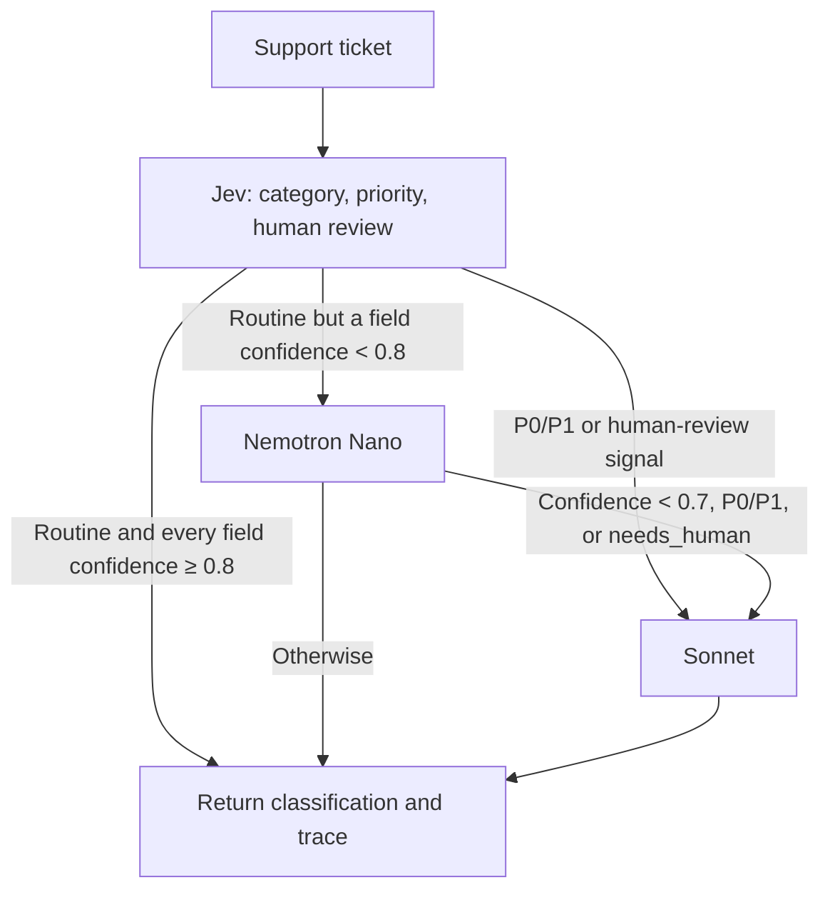

# Jev → Nano → Sonnet: an open source example

This example lives in the existing repository. Run it from source or mount its
MCP server. No separate repository, published package, or workshop is required.
It extends the existing Nemotron/Claude project. The original two-tier app and
generic MCP classifier remain available as separate examples.

The example demonstrates a testable idea: a specialized, low-cost classifier may
answer routine requests; an inexpensive general model may handle some uncertain
requests; a stronger model handles the remaining requests. The comparison measures
whether the middle layer actually helps on the chosen dataset.

## What happens to a ticket?



For example, an invoice-download question may finish at Jev. An ambiguous routine
issue may go to Nano, then Sonnet if Nano is also uncertain. A suspected account
compromise identified by Jev goes directly to Sonnet. These are illustrative routes,
not hardcoded ticket rules or guarantees of correct detection.

Jev produces typed choices and probability distributions; it does not generate a
free-form answer. Its confidence statistic is not a calibrated probability that
the classification is correct. Nano's self-reported confidence is also uncalibrated.
The thresholds are separate policy choices, not equivalent confidence scales.
The 0.8/0.7 thresholds were fixed before this comparison, not tuned on its results.

All models receive the same ticket and classification rubric, in transport-specific
formats. Nano and Sonnet do not receive earlier answers. This makes cached
counterfactual replay possible; passing previous answers would be a different design.
Customer tier supplies context and never triggers escalation by itself.

## Run from source

Clone the `push-mcp` branch using the command in the
[repository README](../README.md). The repository's default branch may not yet
contain this extension. `.nvmrc` selects Node.js 24 for users of nvm.

To inspect and audit the recorded results without credentials or model calls:

```bash
npm ci
npm run audit:three-tier
```

This works from the public files in a fresh checkout. It validates the records
and independently recomputes routes, label matches, model calls and cost estimates.
It does not authenticate provider responses, re-review reference labels, or rerun
inference. Read the [dated result and evidence map](three-tier-results.md).

For **live** classification:

Prerequisites: Node.js 22.13+ on the 22.x line, or Node.js 24+; installed repository
dependencies; a Vercel AI Gateway key that can access Jev; and AWS credentials/model
access for Nano and Sonnet.
The SDK uses its default AWS credential chain. Model IDs and price snapshots are
centralized in `lib/bedrock/models.ts`.

```bash
npm ci
# Supply AI_GATEWAY_API_KEY through your shell's secret mechanism.
# Configure AWS credentials through your usual AWS profile or role.
export AWS_REGION=us-west-2
npm run triage:three-tier -- --example
```

To classify your own ticket, create a JSON file:

```json
{
  "id": "example-42",
  "subject": "Download an invoice",
  "body": "Where can I download a PDF of last month's invoice?",
  "customer_tier": "pro"
}
```

Then run `npm run triage:three-tier -- ticket.json`. The command also accepts `-`
for JSON from stdin. Standalone commands do not automatically load `.env.local`;
the key must be present in their environment. Credentials never belong in ticket
JSON or MCP tool arguments.

The model requests are paid. Every ticket is sent to Vercel/TypeSafe; escalated
tickets are also sent to Bedrock. Use synthetic tickets for the example.
Jev uses `POST https://ai-gateway.vercel.sh/v1/evaluate` with
`model: "typesafe-ai/jev"`, not a chat-completions endpoint.

## Use as an MCP tool

Add this stdio server definition to a compatible MCP client's configuration,
replacing the absolute repository path:

```json
{
  "mcpServers": {
    "ticket-triage": {
      "command": "/absolute/path/to/repo/node_modules/.bin/tsx",
      "args": [
        "--tsconfig",
        "/absolute/path/to/repo/tsconfig.json",
        "/absolute/path/to/repo/mcp/server.ts"
      ],
      "env": { "AWS_REGION": "us-west-2" }
    }
  }
}
```

Keep the explicit `--tsconfig` argument: MCP clients may start the server from
another directory, and the shared Bedrock client uses the repo's TypeScript
import aliases. The command uses the dependency installed by `npm ci`.
The checked-in `.mcp.json` is a convenience configuration for clients that start
in the repository root; use the absolute-path configuration above elsewhere.

Provide `AI_GATEWAY_API_KEY` and AWS credentials through the client's secret
settings or inherited server environment. The two tools are:

| Tool | Input | Behavior |
|---|---|---|
| `triage_three_tier` | `ticket: { id, subject, body, customer_tier? }` | Fixed ticket taxonomy; Jev → Nano → Sonnet policy |
| `cascade_classify` | `text`, `labels`, optional routing controls | Existing generic Nano → Sonnet classifier; no Jev key required |

The generic classifier uses a probability-margin signal and is not the
ticket-domain Nano baseline in the comparison.

## Understand the result

- `decision`: the last model's category, priority, confidence and `needs_human`.
- `review_required`: true if any completed stage detected P0/P1 or `needs_human`.
  Consumers should use this field for human handoff; it can remain true when the
  final model says false. More retained signals may also mean more false alarms.
- `route` and `stages`: which models ran, their decisions, field confidence,
  usage and elapsed time. Jev's reasoning text is a programmatic description.
- `estimated_market_cost_usd`: sum of stage estimates when recorded costs are
  complete. `gateway_reported_cost_usd` is separate: promotional or account credits
  can make it zero without making the service free at market prices.
- `known_market_cost_usd` and `cost_complete`: retries or an unavailable Jev stage
  can leave a partial estimate. These estimates are not a billing statement.

Requests have a 60-second overall deadline. Jev has a 20-second deadline, including
at most one HTTP retry for 429/500/502/503/504. Transient Jev failures fall through
to Nano and are recorded as an unavailable stage. Authentication, missing-key and
invalid-response errors stop the request. Bedrock errors propagate. There is no
automatic ticket mutation or account action.

## Compare the architectures

The comparison uses 150 synthetic tickets with reviewed labels. This split was
already examined in earlier work; the new run is a diagnostic comparison, not an
untouched holdout or evidence of production accuracy.

1. Collect full Nano and Sonnet baseline caches if they do not already exist.
   These commands make paid Bedrock calls. Keep code/configuration unchanged
   between the two runs so their evaluation contexts match.

   ```bash
   npm run bakeoff -- --dataset=production --split=test --config=nano
   npm run bakeoff -- --dataset=production --split=test --config=sonnet
   ```

2. Collect only missing Jev evaluations, with per-ticket checkpoints. This command
   spaces evaluation requests at least 2.4 seconds apart (at most 25/minute) to
   reduce gateway throttling:

   ```bash
   npm run compare:three-tier:collect
   ```

   Account/provider quotas vary. If HTTP 429 persists, wait for the account's
   quota window and rerun: completed tickets are retained. The limiter applies
   only to this process. For an account with sufficient quota,
   `npm run compare:three-tier -- --collect-jev` uses three workers without this
   additional spacing.

3. Replay from the caches with no network calls:

   ```bash
   npm run compare:three-tier
   npm run compare:three-tier:report
   ```

The harness validates historical data, labels, prompt, model, region and pricing
fingerprints while explicitly preserving each baseline's recorded code revision.
It compares six configurations: each model alone plus Nano→Sonnet, Jev→Sonnet,
and Jev→Nano→Sonnet. It also isolates the tickets Jev sent to Nano, measuring
Sonnet calls avoided and classification regressions on those exact tickets.

Reports are written to `docs/research/three-tier-comparison.md` and its JSON
companion. The [Chinese findings](research/three-tier-findings.zh-CN.md) reconstruct
successful-call cost estimates and explain the tradeoffs. They distinguish final
labels from preserved human-review signals.
Latency combines current Jev measurements with historical Bedrock measurements;
it is an estimate, not a live end-to-end benchmark. The rate-limited collector's
Jev latency also includes queueing time; do not use it to compare pure model speed.
Run-specific collection notes are bound to the Jev records hash.

`npm run audit:three-tier` is the separate free audit of the public JSON; it is
usable even when local paid-run caches are absent.
If you deliberately replace the recorded comparison, review the new evidence
and run `npm run audit:three-tier -- --write` to refresh its audit artifact.
Tests detect a stale audit hash rather than silently associating it with a new run.

## Clean up

Stop the CLI or disconnect the MCP server when finished. Clear credentials from
temporary shell/client configuration according to your usual secret handling.
Delete local `.bakeoff-cache` files only if you no longer need them: deleting
them means the next live collection may repeat paid calls. These commands do
not provision persistent cloud infrastructure.

The next validation step after this example is a new, independently labeled dataset
that was not used to choose the policy. The example makes the tradeoff observable;
it does not promise that adding a third model improves it.

Sources: [Vercel evaluation API](https://vercel.com/docs/ai-gateway/modalities/evaluation),
[Vercel model catalog](https://ai-gateway.vercel.sh/v1/models).
